# Mermaid - 文本图表生成工具

Mermaid 是一个基于文本的图表生成工具，让你可以用简单的文本语法创建各种专业图表。

## 什么是 Mermaid？

Mermaid 允许你使用类似 Markdown 的语法创建图表和可视化内容，包括：
- 流程图
- 时序图
- 甘特图
- 类图
- 状态图
- 饼图
- 等等...

## 流程图

### 基本流程图

````markdown
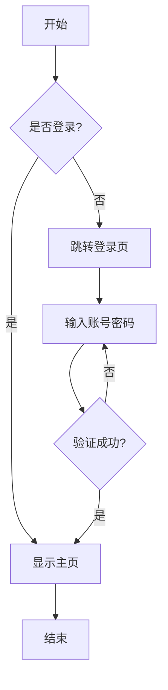
````

效果：

<div style="width: 300px">


</div>

### 流程图方向

- `TD` 或 `TB` - 从上到下
- `BT` - 从下到上
- `LR` - 从左到右
- `RL` - 从右到左

````markdown
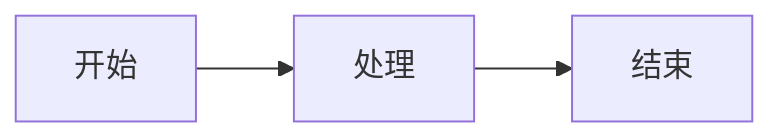
````

效果：

<div style="width: 600px">


</div>

### 节点形状

````markdown
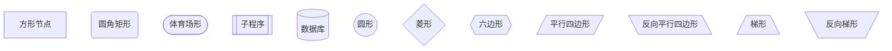
````

效果：

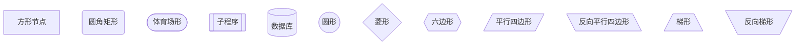

## 时序图

时序图用于展示对象之间的交互顺序。

````markdown
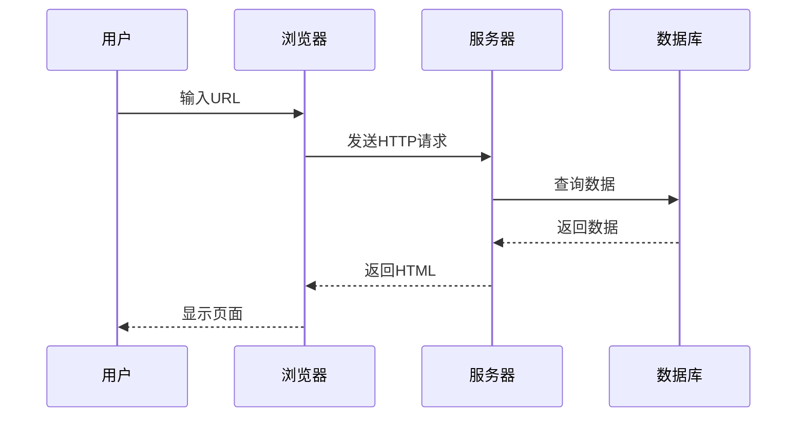
````

效果：


### 激活和注释

````markdown
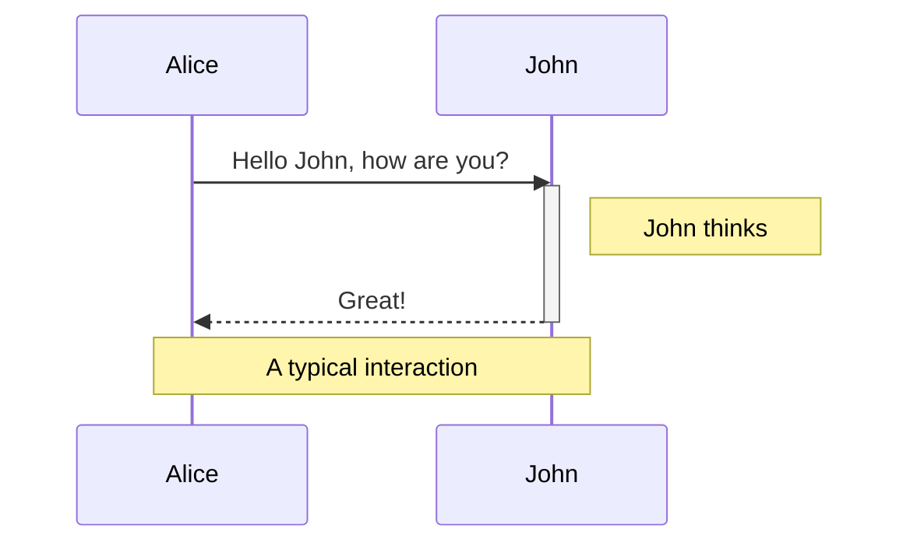
````

效果：


## 甘特图

甘特图用于项目管理和进度规划。

````markdown
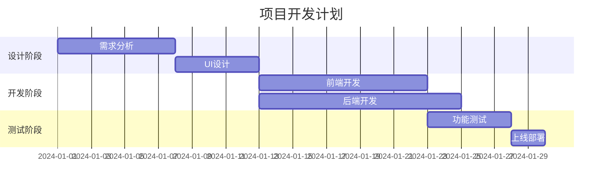
````

效果：


## 饼图

````markdown
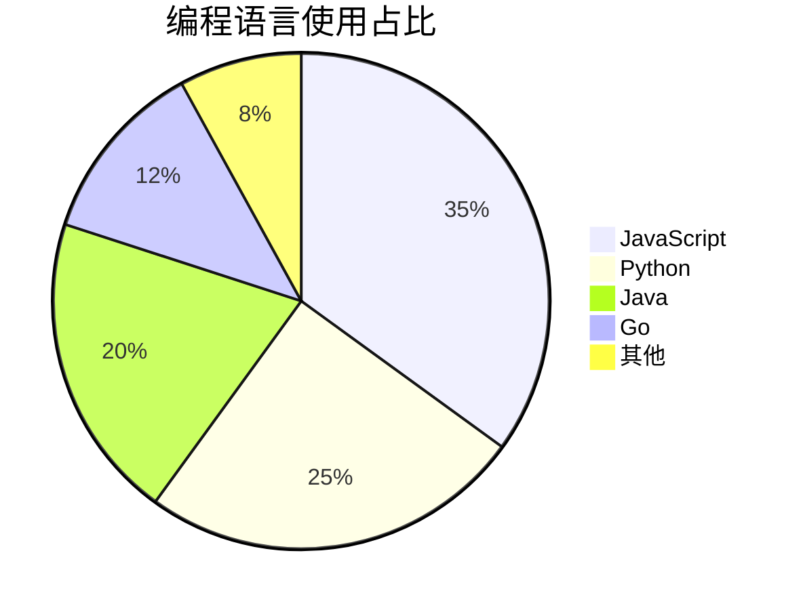
````

效果：


## 类图

类图用于展示面向对象系统的结构。

````markdown
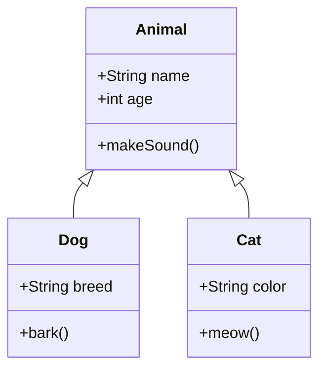
````

效果：

<div style="width: 600px">


</div>

### 关系类型

- `<|--` - 继承
- `*--` - 组合
- `o--` - 聚合
- `-->` - 关联
- `--` - 链接（实线）
- `..>` - 依赖
- `..|>` - 实现
- `..` - 链接（虚线）

## 状态图

````markdown
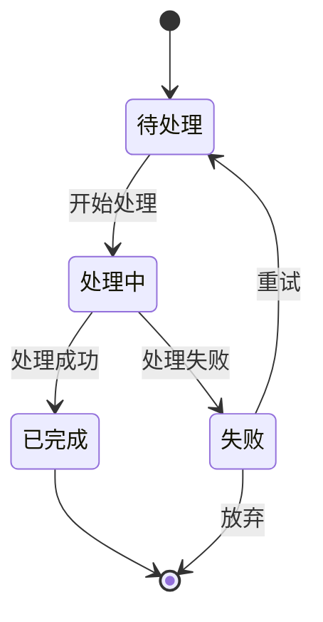
````

效果：

<div style="width: 600px">


</div>

## ER 图（实体关系图）

````markdown
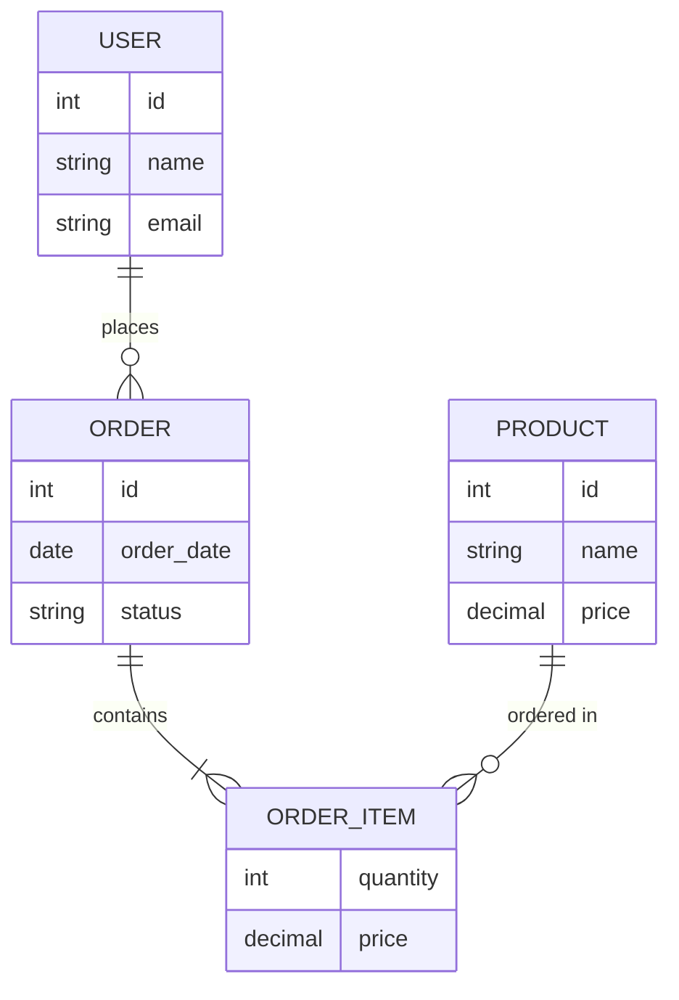
````

效果：

<style>
.nodeLabel {
    color: black
}
</style>
<div style="width: 600px; ">


</div>

## Git 图

````markdown
```mermaid
gitGraph
    commit
    commit
    branch develop
    checkout develop
    commit
    commit
    checkout main
    merge develop
    commit
    commit
```
````

效果：

<div style="width: 600px; ">

```mermaid
gitGraph
    commit
    commit
    branch develop
    checkout develop
    commit
    commit
    checkout main
    merge develop
    commit
    commit
```

</div>

## 用户旅程图

````markdown
```mermaid
journey
    title 用户购物旅程
    section 浏览商品
      访问网站: 5: 用户
      搜索商品: 3: 用户
      查看详情: 4: 用户
    section 购买
      加入购物车: 4: 用户
      填写信息: 2: 用户
      支付: 3: 用户
    section 收货
      等待发货: 2: 用户
      收到商品: 5: 用户
      评价: 4: 用户
```
````

效果：

<style>
color: black
</style>

<div style="width: 1000px; ">

```mermaid
journey
    title 用户购物旅程
    section 浏览商品
      访问网站: 5: 用户
      搜索商品: 3: 用户
      查看详情: 4: 用户
    section 购买
      加入购物车: 4: 用户
      填写信息: 2: 用户
      支付: 3: 用户
    section 收货
      等待发货: 2: 用户
      收到商品: 5: 用户
      评价: 4: 用户
```

</div>

## 实际应用示例

### API 调用流程

````markdown
```mermaid
sequenceDiagram
    participant C as Client
    participant A as API Gateway
    participant S as Service
    participant D as Database
    participant R as Redis Cache
    
    C->>A: POST /api/users
    A->>A: 验证 Token
    A->>S: 转发请求
    S->>R: 检查缓存
    R-->>S: 缓存未命中
    S->>D: 查询数据库
    D-->>S: 返回数据
    S->>R: 更新缓存
    S-->>A: 返回响应
    A-->>C: 返回 JSON
```
````

效果：

```mermaid
sequenceDiagram
    participant C as Client
    participant A as API Gateway
    participant S as Service
    participant D as Database
    participant R as Redis Cache
    
    C->>A: POST /api/users
    A->>A: 验证 Token
    A->>S: 转发请求
    S->>R: 检查缓存
    R-->>S: 缓存未命中
    S->>D: 查询数据库
    D-->>S: 返回数据
    S->>R: 更新缓存
    S-->>A: 返回响应
    A-->>C: 返回 JSON
```

### 微服务架构

````markdown
```mermaid
graph TB
    subgraph "前端层"
        Web[Web App]
        Mobile[Mobile App]
    end
    
    subgraph "API 网关"
        Gateway[API Gateway]
    end
    
    subgraph "服务层"
        UserService[用户服务]
        OrderService[订单服务]
        ProductService[商品服务]
        PaymentService[支付服务]
    end
    
    subgraph "数据层"
        UserDB[(用户数据库)]
        OrderDB[(订单数据库)]
        ProductDB[(商品数据库)]
    end
    
    Web --> Gateway
    Mobile --> Gateway
    Gateway --> UserService
    Gateway --> OrderService
    Gateway --> ProductService
    Gateway --> PaymentService
    UserService --> UserDB
    OrderService --> OrderDB
    ProductService --> ProductDB
    OrderService --> PaymentService
```
````

效果：

```mermaid
graph TB
    subgraph "前端层"
        Web[Web App]
        Mobile[Mobile App]
    end
    
    subgraph "API 网关"
        Gateway[API Gateway]
    end
    
    subgraph "服务层"
        UserService[用户服务]
        OrderService[订单服务]
        ProductService[商品服务]
        PaymentService[支付服务]
    end
    
    subgraph "数据层"
        UserDB[(用户数据库)]
        OrderDB[(订单数据库)]
        ProductDB[(商品数据库)]
    end
    
    Web --> Gateway
    Mobile --> Gateway
    Gateway --> UserService
    Gateway --> OrderService
    Gateway --> ProductService
    Gateway --> PaymentService
    UserService --> UserDB
    OrderService --> OrderDB
    ProductService --> ProductDB
    OrderService --> PaymentService
```

## 最佳实践

### 1. 保持简洁

避免在一个图表中放入过多信息，必要时拆分成多个图表。

### 2. 使用有意义的标签

使用清晰、描述性的节点名称和标签。

### 3. 合理使用子图

使用 `subgraph` 对相关节点进行分组。

### 4. 选择合适的图表类型

- 流程图 - 展示流程和决策
- 时序图 - 展示时间顺序的交互
- 甘特图 - 展示项目进度
- 类图 - 展示系统结构
- 状态图 - 展示状态变化

### 5. 添加注释

使用 `Note` 添加必要的说明。

## 小结

在本章中，你学会了：
- ✅ Mermaid 的基本语法
- ✅ 创建各种类型的图表
- ✅ 流程图、时序图、甘特图等的使用
- ✅ 在技术文档中应用图表
- ✅ 图表设计的最佳实践

Mermaid 让你可以用简单的文本创建专业的图表，非常适合技术文档！

---

💡 **提示**：
- 并非所有 Markdown 渲染器都支持 Mermaid
- 复杂图表可能需要调整布局
- 可以在 [Mermaid Live Editor](https://mermaid.live/) 中预览和调试
- 保持图表简洁，避免过度复杂

📝 **相关资源**：
- [Mermaid 官方文档](https://mermaid.js.org/)
- [Mermaid Live Editor](https://mermaid.live/)
- [Mermaid 语法速查](https://mermaid.js.org/intro/syntax-reference.html)

