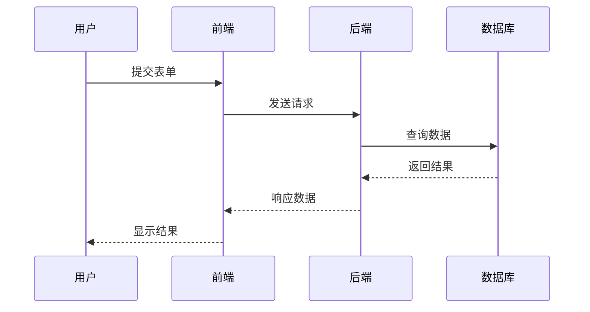

## 时序图

```mermaid
sequenceDiagram
    participant 用户
    participant 前端
    participant 后端
    participant 数据库
    
    用户->>前端: 提交表单
    前端->>后端: 发送请求
    后端->>数据库: 查询数据
    数据库-->>后端: 返回结果
    后端-->>前端: 响应数据
    前端-->>用户: 显示结果
```